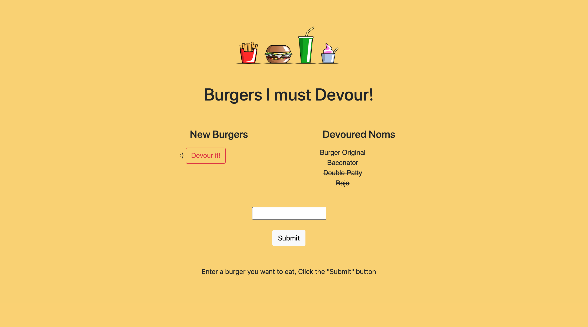

# For The Love of Burgers

## Description

For The Love of Burgers is a restaurant app that lets users input the names of burgers they'd like to eat. This application is a burger logger built with MySQL, Node, Express, Handlebars and a homemade ORM, following an MVC design pattern.

Screenshot of application:

Deployed app is deployed to Heroku, [here](https://aqueous-scrubland-45192.herokuapp.com/)

To watch a screencast of the running application, please click here: [Screencast](https://drive.google.com/file/d/1yQ2FO9b0qIQB7dR2TvWpKbDTWtjJ_Itj/view)

This a simple note taker application. It can be used to write, save, and delete notes. The application uses an express backend then saves and retrieves note data from a JSON file.

## Table of Contents

* [Installation](#Installation)
* [Usage](#Usage)
* [Contributing](#Contributing)
* [Tests](#Tests)
* [License](#License)
* [Questions](#Questions)

## Installation
To install, simply clone or download the repository

## Usage
The application allows users to input names of burgers they would like to eat. Simply access the deployed app by clicking the Heroku link above.

- When a user submits a burger's name, it displays under a "New Buergers" section. 
- Burgers in the "New Burgers" section have a 'Devour it!' button
- When a user click the button, the burger will move to the right side of the page under a "Devoured Noms" section
- The app stores every burger into a database

## Contributing
We love seeing community contribution to any opensource project! If you would like to contribute, please do.

## Tests
Unit tests included in test files. Make sure when making edits that all unit tests pass.

## License
This project is released under BSD 2 Clause opensource license:

https://opensource.org/licenses/BSD-2-Clause

## Questions
For more about my work, check out my Github profile: https://github.com/nard1n

If you have any questions and would like to chat, please feel free to send me an email directly to nardin.lachowski@gmail.com
